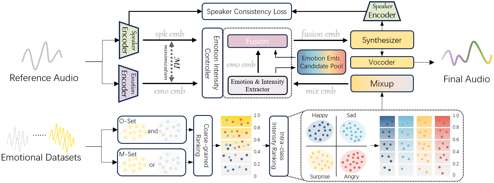

# RSET: Remapping-based Sorting Method for Emotion Transfer Speech Synthesis

## Abstract

Although current Text-To-Speech (TTS) models are able to generate high-quality speech samples, there are still challenges in developing emotion intensity controllable TTS. Most existing TTS models achieve emotion intensity control by extracting intensity information from reference speeches. Unfortunately, limited by the lack of modeling for intra-class emotion intensity and the model's information decoupling capability, the generated speech cannot achieve fine-grained emotion intensity control and suffers from information leakage issues. In this paper, we propose an emotion transfer TTS model, which defines a remapping-based sorting method to model intra-class relative intensity information, combined with Mutual Information (MI) to decouple speaker and emotion information, and synthesizes expressive speeches with perceptible intensity differences. Experiments show that our model achieves fine-grained emotion control while preserving speaker information.

## Overview

Figure.1 The Architecture of RSET

## Samples
Audio samples are taken from the ESD dataset.

### Quality and Similarity

<table>
    <tr>
        <th> Reference </th>
        <th> Mixed Emotion </th>
        <th> EmoMix </th>
        <th> Ours </th>
    </tr>
<tr>
	<th> <audio controls id="player" onplay="pauseOthers(this);"><source src="assets/sim/1_ref.wav" type="audio/mpeg"></audio> </th>
        <th> <audio controls id="player" onplay="pauseOthers(this);"><source src="assets/sim/1_fec.wav" type="audio/mpeg"></audio> </th>
        <th> <audio controls id="player" onplay="pauseOthers(this);"><source src="assets/sim/1_cet.wav" type="audio/mpeg"></audio> </th>
	<th> <audio controls id="player" onplay="pauseOthers(this);"><source src="assets/sim/1_emoremap.wav" type="audio/mpeg"></audio> </th>
</tr>
<tr>
	<th> <audio controls id="player" onplay="pauseOthers(this);"><source src="assets/sim/2_ref.wav" type="audio/mpeg"></audio> </th>
        <th> <audio controls id="player" onplay="pauseOthers(this);"><source src="assets/sim/2_fec.wav" type="audio/mpeg"></audio> </th>
        <th> <audio controls id="player" onplay="pauseOthers(this);"><source src="assets/sim/2_cet.wav" type="audio/mpeg"></audio> </th>
	<th> <audio controls id="player" onplay="pauseOthers(this);"><source src="assets/sim/2_emoremap.wav" type="audio/mpeg"></audio> </th>
</tr>	
<tr>
	<th> <audio controls id="player" onplay="pauseOthers(this);"><source src="assets/sim/3_ref.wav" type="audio/mpeg"></audio> </th>
        <th> <audio controls id="player" onplay="pauseOthers(this);"><source src="assets/sim/3_fec.wav" type="audio/mpeg"></audio> </th>
        <th> <audio controls id="player" onplay="pauseOthers(this);"><source src="assets/sim/3_cet.wav" type="audio/mpeg"></audio> </th>
	<th> <audio controls id="player" onplay="pauseOthers(this);"><source src="assets/sim/3_emoremap.wav" type="audio/mpeg"></audio> </th>
</tr>	
<tr>
	<th> <audio controls id="player" onplay="pauseOthers(this);"><source src="assets/sim/4_ref.wav" type="audio/mpeg"></audio> </th>
        <th> <audio controls id="player" onplay="pauseOthers(this);"><source src="assets/sim/4_fec.wav" type="audio/mpeg"></audio> </th>
        <th> <audio controls id="player" onplay="pauseOthers(this);"><source src="assets/sim/4_cet.wav" type="audio/mpeg"></audio> </th>
	<th> <audio controls id="player" onplay="pauseOthers(this);"><source src="assets/sim/4_emoremap.wav" type="audio/mpeg"></audio> </th>
</tr>	
<tr>
	<th> <audio controls id="player" onplay="pauseOthers(this);"><source src="assets/sim/5_ref.wav" type="audio/mpeg"></audio> </th>
        <th> <audio controls id="player" onplay="pauseOthers(this);"><source src="assets/sim/5_fec.wav" type="audio/mpeg"></audio> </th>
        <th> <audio controls id="player" onplay="pauseOthers(this);"><source src="assets/sim/5_cet.wav" type="audio/mpeg"></audio> </th>
	<th> <audio controls id="player" onplay="pauseOthers(this);"><source src="assets/sim/5_emoremap.wav" type="audio/mpeg"></audio> </th>
</tr>	
<tr>
	<th> <audio controls id="player" onplay="pauseOthers(this);"><source src="assets/sim/6_ref.wav" type="audio/mpeg"></audio> </th>
        <th> <audio controls id="player" onplay="pauseOthers(this);"><source src="assets/sim/6_fec.wav" type="audio/mpeg"></audio> </th>
        <th> <audio controls id="player" onplay="pauseOthers(this);"><source src="assets/sim/6_cet.wav" type="audio/mpeg"></audio> </th>
	<th> <audio controls id="player" onplay="pauseOthers(this);"><source src="assets/sim/6_emoremap.wav" type="audio/mpeg"></audio> </th>
</tr>	
</table>

&nbsp;
 

### Intensity Controllability

 Reference Audio - Sad 

<audio controls id="players" onplay="pauseOthers(this);"><source src="assets/emo/sad/ref.wav" type="audio/mpeg"></audio> 

<table>
	<CAPTION>Text: I feel really bad today.</CAPTION>
    <tr>
        <th> Intensity </th>
        <th> 0.2 </th> 
        <th> 0.4 </th>
        <th> 0.6 </th>
	<th> 0.8 </th>
    </tr>
<tr>
        <th> Mixed Emotion </th>
	<th> <audio controls id="player" onplay="pauseOthers(this);"><source src="assets/emo/sad/fec/0.2.wav" type="audio/mpeg"></audio> </th>
        <th> <audio controls id="player" onplay="pauseOthers(this);"><source src="assets/emo/sad/fec/0.4.wav" type="audio/mpeg"></audio> </th>
        <th> <audio controls id="player" onplay="pauseOthers(this);"><source src="assets/emo/sad/fec/0.6.wav" type="audio/mpeg"></audio> </th>
        <th> <audio controls id="player" onplay="pauseOthers(this);"><source src="assets/emo/sad/fec/0.8.wav" type="audio/mpeg"></audio> </th>
</tr>
    <tr>
        <th> Intensity </th>
        <th> 0.2 </th> 
        <th> 0.4 </th>
        <th> 0.6 </th>
	<th> 0.8 </th>
    </tr>
<tr>
        <th> Ours </th>
	<th> <audio controls id="player" onplay="pauseOthers(this);"><source src="assets/emo/sad/emoremap/-0.4.wav" type="audio/mpeg"></audio> </th>
        <th> <audio controls id="player" onplay="pauseOthers(this);"><source src="assets/emo/sad/emoremap/-0.2.wav" type="audio/mpeg"></audio> </th>
        <th> <audio controls id="player" onplay="pauseOthers(this);"><source src="assets/emo/sad/emoremap/0.2.wav" type="audio/mpeg"></audio> </th>
        <th> <audio controls id="player" onplay="pauseOthers(this);"><source src="assets/emo/sad/emoremap/0.4.wav" type="audio/mpeg"></audio> </th>
</tr>	
</table>

&nbsp;
 

 Reference Audio - Surprise 

<audio controls id="players" onplay="pauseOthers(this);"><source src="assets/emo/sur/ref.wav" type="audio/mpeg"></audio> 

<table>
	<CAPTION>Text: We finally made it!</CAPTION>
    <tr>
        <th> Intensity </th>
        <th> 0.2 </th> 
        <th> 0.4 </th>
        <th> 0.6 </th>
	<th> 0.8 </th>
    </tr>
<tr>
        <th> Mixed Emotion </th>
	<th> <audio controls id="player" onplay="pauseOthers(this);"><source src="assets/emo/sur/fec/0.2.wav" type="audio/mpeg"></audio> </th>
        <th> <audio controls id="player" onplay="pauseOthers(this);"><source src="assets/emo/sur/fec/0.4.wav" type="audio/mpeg"></audio> </th>
        <th> <audio controls id="player" onplay="pauseOthers(this);"><source src="assets/emo/sur/fec/0.6.wav" type="audio/mpeg"></audio> </th>
        <th> <audio controls id="player" onplay="pauseOthers(this);"><source src="assets/emo/sur/fec/0.8.wav" type="audio/mpeg"></audio> </th>
</tr>
    <tr>
        <th> Intensity </th>
        <th> 0.2 </th> 
        <th> 0.4 </th>
        <th> 0.6 </th>
	<th> 0.8 </th>
    </tr>
<tr>
        <th> Ours </th>
	<th> <audio controls id="player" onplay="pauseOthers(this);"><source src="assets/emo/sur/emoremap/-0.4.wav" type="audio/mpeg"></audio> </th>
        <th> <audio controls id="player" onplay="pauseOthers(this);"><source src="assets/emo/sur/emoremap/-0.2.wav" type="audio/mpeg"></audio> </th>
        <th> <audio controls id="player" onplay="pauseOthers(this);"><source src="assets/emo/sur/emoremap/0.2.wav" type="audio/mpeg"></audio> </th>
        <th> <audio controls id="player" onplay="pauseOthers(this);"><source src="assets/emo/sur/emoremap/0.4.wav" type="audio/mpeg"></audio> </th>
</tr>	
</table>

&nbsp;

 Reference Audio - Angry 

<audio controls id="players" onplay="pauseOthers(this);"><source src="assets/emo/ang/ref.wav" type="audio/mpeg"></audio> 

<table>
	<CAPTION>Text: Please don't bother me again!</CAPTION>
    <tr>
        <th> Intensity </th>
        <th> 0.2 </th> 
        <th> 0.4 </th>
        <th> 0.6 </th>
	<th> 0.8 </th>
    </tr>
<tr>
        <th> Mixed Emotion </th>
	<th> <audio controls id="player" onplay="pauseOthers(this);"><source src="assets/emo/ang/fec/0.2.wav" type="audio/mpeg"></audio> </th>
        <th> <audio controls id="player" onplay="pauseOthers(this);"><source src="assets/emo/ang/fec/0.4.wav" type="audio/mpeg"></audio> </th>
        <th> <audio controls id="player" onplay="pauseOthers(this);"><source src="assets/emo/ang/fec/0.6.wav" type="audio/mpeg"></audio> </th>
        <th> <audio controls id="player" onplay="pauseOthers(this);"><source src="assets/emo/ang/fec/0.8.wav" type="audio/mpeg"></audio> </th>
</tr>
    <tr>
        <th> Intensity </th>
        <th> 0.2 </th> 
        <th> 0.4 </th>
        <th> 0.6 </th>
	<th> 0.8 </th>
    </tr>
<tr>
        <th> Ours </th>
	<th> <audio controls id="player" onplay="pauseOthers(this);"><source src="assets/emo/ang/emoremap/-0.4.wav" type="audio/mpeg"></audio> </th>
        <th> <audio controls id="player" onplay="pauseOthers(this);"><source src="assets/emo/ang/emoremap/-0.2.wav" type="audio/mpeg"></audio> </th>
        <th> <audio controls id="player" onplay="pauseOthers(this);"><source src="assets/emo/ang/emoremap/0.2.wav" type="audio/mpeg"></audio> </th>
        <th> <audio controls id="player" onplay="pauseOthers(this);"><source src="assets/emo/ang/emoremap/0.4.wav" type="audio/mpeg"></audio> </th>
</tr>	
</table>

&nbsp;

 Reference Audio - Happy 

<audio controls id="players" onplay="pauseOthers(this);"><source src="assets/emo/happy/ref.wav" type="audio/mpeg"></audio> 

<table>
	<CAPTION>Text: Some really joyful things happened today!</CAPTION>
    <tr>
        <th> Intensity </th>
        <th> 0.2 </th> 
        <th> 0.4 </th>
        <th> 0.6 </th>
	<th> 0.8 </th>
    </tr>
<tr>
        <th> Mixed Emotion </th>
	<th> <audio controls id="player" onplay="pauseOthers(this);"><source src="assets/emo/happy/fec/0.2.wav" type="audio/mpeg"></audio> </th>
        <th> <audio controls id="player" onplay="pauseOthers(this);"><source src="assets/emo/happy/fec/0.4.wav" type="audio/mpeg"></audio> </th>
        <th> <audio controls id="player" onplay="pauseOthers(this);"><source src="assets/emo/happy/fec/0.6.wav" type="audio/mpeg"></audio> </th>
        <th> <audio controls id="player" onplay="pauseOthers(this);"><source src="assets/emo/happy/fec/0.8.wav" type="audio/mpeg"></audio> </th>
</tr>
    <tr>
        <th> Intensity </th>
        <th> 0.2 </th> 
        <th> 0.4 </th>
        <th> 0.6 </th>
	<th> 0.8 </th>
    </tr>
<tr>
        <th> Ours </th>
	<th> <audio controls id="player" onplay="pauseOthers(this);"><source src="assets/emo/happy/emoremap/-0.4.wav" type="audio/mpeg"></audio> </th>
        <th> <audio controls id="player" onplay="pauseOthers(this);"><source src="assets/emo/happy/emoremap/-0.2.wav" type="audio/mpeg"></audio> </th>
        <th> <audio controls id="player" onplay="pauseOthers(this);"><source src="assets/emo/happy/emoremap/0.2.wav" type="audio/mpeg"></audio> </th>
        <th> <audio controls id="player" onplay="pauseOthers(this);"><source src="assets/emo/happy/emoremap/0.4.wav" type="audio/mpeg"></audio> </th>
</tr>	
</table>

&nbsp;

